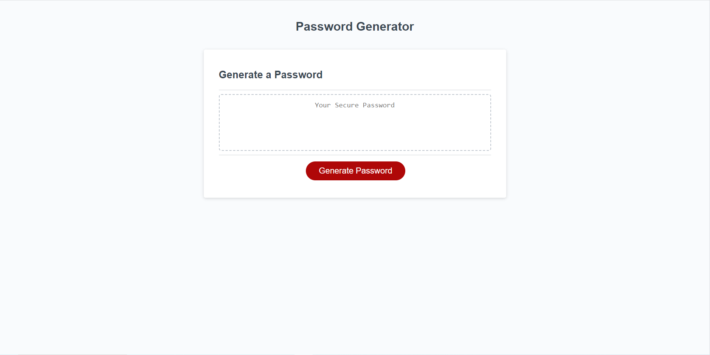

# weekThreeChallenge_PasswordGenerator

## Description

I completed this project to better my understanding of Java Script. I built this project to challenge myself at using Java Script and prove that I can make successful code using Java Script. This website solves the problem of creating passwords quickly and to the users specifications. I learned how Java Script is used to create functionality for a website.
## Usage

You can generate random passwords by clicking the button and selecting the critera that you want in your password.

